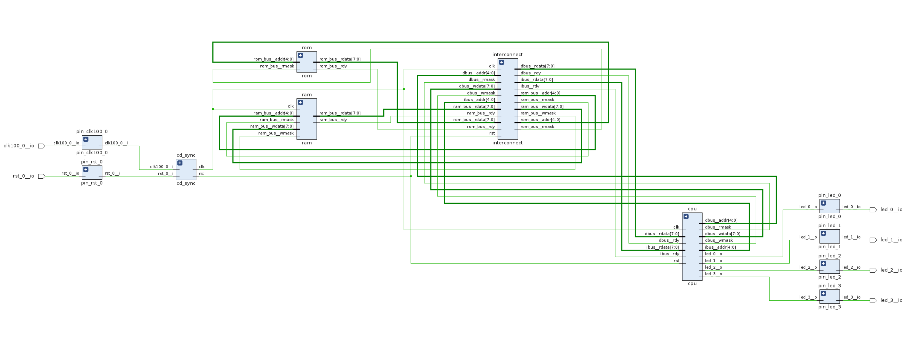
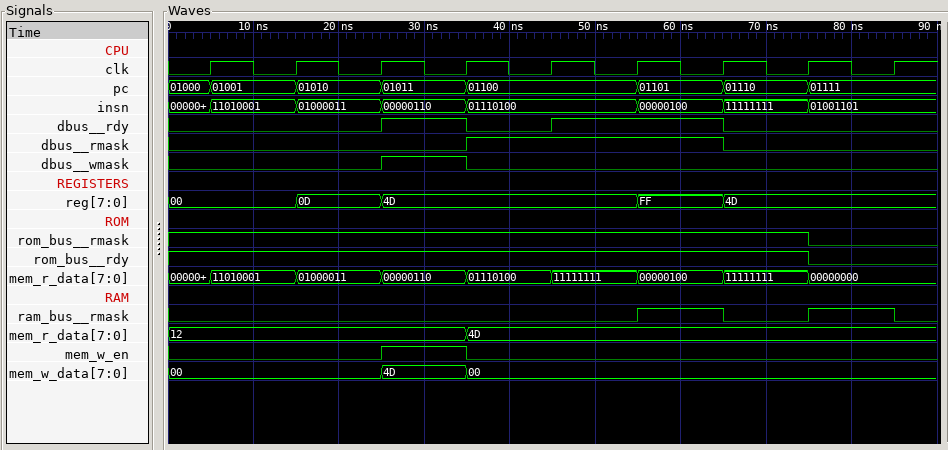

# Notes - toysoc

A minimalist SOC to debug the interconnect

8 bits instructions, 1 register (8 bits)

code       | note
-----------|---
`00000000` | NOP
`11111111` | HALT
`dddd-001` | Load immediate `dddd` to register low nibble
`dddd-011` | Load immediate `dddd` to register high nibble
`aaaaa100` | LOAD adress `aaaaa` to register
`aaaaa110` | STORE register to adress `aaaaa`

The address bus is 5 bits wide, upper 2 select the device
- device 0 is RAM
- device 1 is ROM

The reset vector is `0b01000`: the CPU is booting from ROM.

## Simulation

Code:
```
                0b00000000,  # NOP
                0b11010001,  # LILO M: 0100 1101
                0b01000011,  # LIHI M: 0100 1101
                0b00000110,  # STORE reg to RAM             (1 cycle)
                0b01110100,  # LOAD reg from ROM adress 6   (2 cycles)
                0b00000100,  # LOAD reg from RAM            (1 cycle)
                0b00000000,  # NOP
```





Proof of concept implementation using [Logisim evolution](https://github.com/reds-heig/logisim-evolution): [toysoc.circ](toysoc.circ)

## Conclusion

- distributed RAM (single port) does not work: combinatorial loop
- distributed RAM (simple dual port): works with 0 latency
- hart implementation does account for any memory latency (incl. 0)
